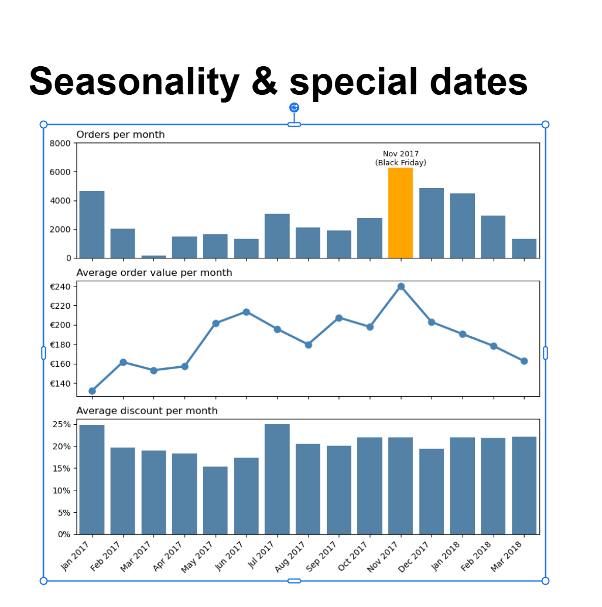

# Analysis-and-evaluation-of-Eniac-s-discount-strategy

Our team evaluated Eniac's current discount strategy and was tasked with determining whether the current strategy should be abandoned or changed. After an intensive data cleaning and preparation phase, followed by our analysis, we came to the conclusion that the current discount strategy should be adjusted.

#Dataset

orders: List of all orders and the price paid by the customers.

orderlines: Detailed list of all products involved in an order and the price paid for each product.

products: List of all products offered by Eniac.

# Key findings & Results

The orders and orderlines DataFrames required extensive data cleaning before the actual analysis could be conducted. As the original column containing the discounts offered for each product was corrupted, the discounts were calculated by subtracting the unit price paid by the customer from the product price in the products DataFrame.

After our cleaning process and analysis, our key findings were:

1. Cap standard discounts at 20%: Higher discounts within our dataset mostly performed considerably worse.
   
2. Rebalance discounts towards high-end products and away from low-budget items: Low-priced products receive the biggest discounts (around 24.4%) but account for only 5.9% of total revenue. High-priced products are barely discounted (16%) yet account for 56.1% of total revenue.

3. Seasonal patterns matter: November was the best month of the year in terms of orders and average order value, despite not having the year's highest discount.

# Technologies used

Presentation: Google Slides

Machine learning: ChatGPT

The entire data cleaning, analysis, and visualization of the results was carried out using Python. The following modules were used:

Data cleaning and analysis: Pandas

Data visualization: Matplotlib, Seaborn 

# Project structure

README: Project documentation

Final_Data_cleaning: The entire data cleaning process conducted by our team.

Final_quality_assesement: Date and time conversions and final preparations for the visualizations.

Visualizations: Building visualizations for our final presentation.

Presentation: The presentation created by our team.

# Visualisations

This bar chart shows the performance of our discount groups compared to products sold without a discount.

The following graphic shows that the current discount strategy disregards seasonality and the increased customer consumption during November and December. 

This graphic shows that, in the case of most product categories sold by Eniac, discounts of 10–20% perform best.

# Future work

With additional time, we recommend conducting a detailed analysis for each product category. In doing so, Eniac would be able to develop a highly refined strategy for each category, identifying not only the most profitable discount group for each category but also taking seasonality into account.
